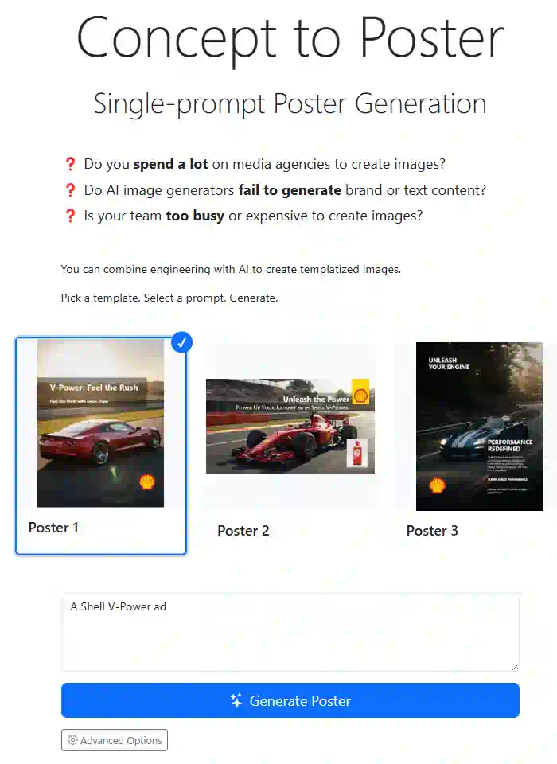

# PosterGen

PosterGen is an AI-powered tool that combines templated designs with generative AI to create professional posters from simple text prompts. It solves common challenges with AI image generation by using predefined templates while leveraging AI to fill in content.

## Features

- **Template-Based Generation**: Choose from multiple poster templates
- **Single-Prompt Interface**: Describe your poster concept in natural language
- **AI-Powered Content**: Automatically generates appropriate text and images
- **Customizable Components**: Each template has configurable text and image areas
- **Advanced Options**: Fine-tune the system prompt for specialized results
- **One-Click Download**: Export your poster as a PNG image

## Screenshot



## Usage

1. Select a poster template from the gallery
2. Enter a brief description of your poster concept
3. Click "Generate Poster"
4. Review the AI's reasoning and generated content
5. Download your finished poster

## Example Prompts

- "A Shell V-Power ad emphasizing high-performance fuel benefits"
- "A Gartner conference poster for a machine learning summit"
- "A summer music festival announcement with lineup details"
- "A Gold's Gym promotion highlighting new equipment"
- "An Apple iPhone 15 Pro Max launch poster"

## Setup

You need:

- Modern web browser (Chrome, Firefox, Safari, Edge)
- An [LLM Foundry](https://llmfoundry.straive.com/) account for API access

## Setup

1. Clone this repository:

```bash
git clone https://github.com/gramener/postergen.git
cd postergen
```

2. Serve the files using any static web server. For example, using Python:

```bash
python -m http.server
```

3. Open `http://localhost:8000` in your web browser

## Creating a new template

1. Copy an existing template into a new file in `templates/`, e.g. `templates/poster-new.html`
2. Add a new entry into `config.json` under `templates` like this:
   ```json
   {
     "name": "Poster New",
     "image": "https://placehold.co/300x300/f8d7da/dc3545",
     "template": "templates/poster-new.html"
   }
   ```
3. Preview and modify the template.
   - For each element that needs to be filled dynamically, add these attributes:
     - `data-name`: a unique name for the element
     - `data-prompt`: prompt for the LLM to fill the element using the poster brief. Typically, this should describe the placeholder. Examples:
       - `data-prompt="A large background image for the poster"` (for background image)
       - `data-prompt="Large title of the poster (2-5 words)"` (for title)
       - `data-prompt="Subtitle of the poster (4-8 words)"` (for subtitle)
   - Poster should contain only 1 root element. Else Download PNG will fail.
   - Avoid external links (stylesheets, scripts, images) and use data URIs or inline styles instead. Else Download PNG will fail.

## Technology

### Architecture

PosterGen uses a client-side architecture that connects to LLM Foundry APIs for AI generation:

1. User selects a template and enters a prompt
2. The system sends the prompt to GPT-4o-mini for content generation
3. Image prompts are sent to Imagen 3.0 for visual generation
4. Results are rendered in the browser and can be downloaded as PNG

### Project Structure

- `index.html` - Main application interface
- `script.js` - Core application logic
- `utils.js` - Helper functions
- `config.json` - Template configuration
- [loading.svg](loading.svg) - spinner via [SVGBackgrounds.com](https://www.svgbackgrounds.com/elements/animated-svg-preloaders/)
- `templates/` - HTML templates for different poster designs

### Libraries

- **asyncLLM**: Streaming API responses
- **marked**: Markdown parsing for AI responses
- **html2canvas**: Converting DOM elements to images
- **Bootstrap**: UI framework for responsive design

## License

[MIT License](LICENSE)
